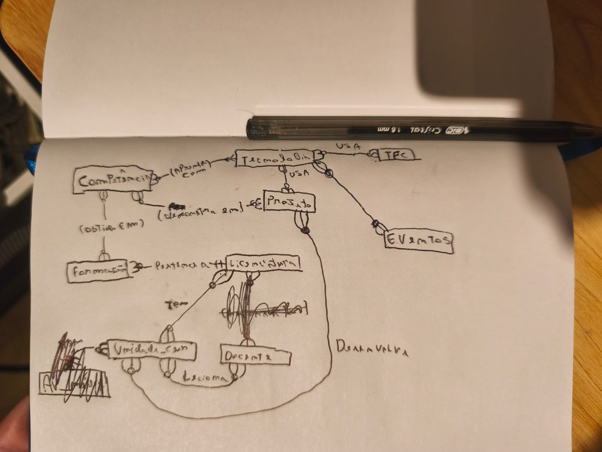

comecei por identificar as entidades principais do projeto com base no enunciado, depois defini os atributos de cada entidade e as relações entre elas, desenhei o DER e implementei os models django

A tabela escolhida para ser criada além das pedidas foi a tabela EVENTOS, essa tabela vai conter os eventos que participamos e tem ligaçao com tecnologias (podendo conter uma ou mais tecnologias), exemplos de eventos que podem estar nesse campo sao os que participamos na tecweb.

usei IA (claude e chatGPT) para me ajudar a adaptar o script de populacao e a resolver erros que apareceram durante o desenvolvimento

LAB 7 - Fiz a integraçao da bd do portfolio com as views em html, nao consegui fazer o css de jeito nenhum, pedi pra ia fazer dentro do próprio html como alternativa.

LAB 8 - Implementei CRUD para Projeto, Tecnologia, Competencia e Formacao, criei a classe TipoTecnologia para organizar as tecnologias por categoria, e criei a pagina "Sobre esta Aplicacao" com arquitetura MVT, modelacao, tecnologias e making-of.

usei IA (claude e Grok) para ajudar a estruturar o forms.py, as views CRUD e os templates, e para resolver erros como o csrf_token em falta e o NoReverseMatch nas URLs.

LAB 9
Implementei autenticação por username e password. Criei a aplicação accounts com as views de login, logout e registo, usando as funções utilitárias do django (authenticate, login, logout) e o UserCreationForm como base do formulário de registo. O navbar do base.html foi atualizado para mostrar o nome do utilizador e o link de logout quando autenticado, ou os links de login e registo quando não autenticado.

